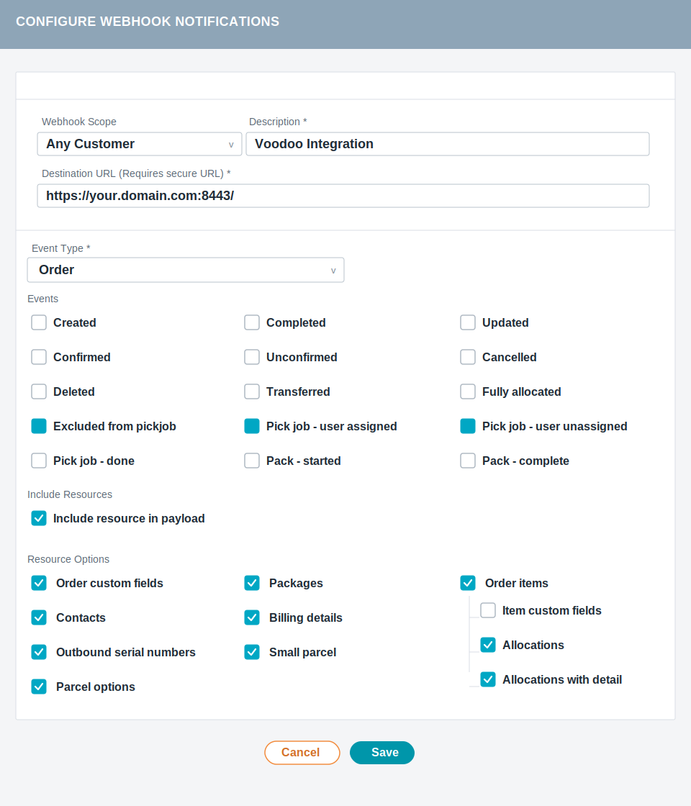

# Extensiv to Voodoo Devices Demo

> **This repository is sample integration code** showing how to connect
> Extensiv to Voodoo Robotics devices and automatically turn Extensiv order
> events into commands for a Voodoo-powered workflow. The code is intentionally
> over-commented so it can be copied, modified, and adapted to real deployments.

Receives HTTPS webhook POST requests from Extensiv's 3PL Warehouse Manager,
parses order events, extracts a pick list (SKU, quantity, location, lot) from
each order's allocations, and forwards orders to the Voodoo Robotics API so
Voodoo Robotics devices can act on those instructions.

Voodoo Robotics:
[https://voodoorobotics.com/](https://voodoorobotics.com/)

## Files in this project

| File | Purpose |
|------|--------|
| `server.py` | **Main integration service** — receives Extensiv webhooks, validates them, extracts picks, and syncs orders to Voodoo. |
| `basicExtensivReceiver.py` | **Demo/reference** — an earlier, simpler version that just prints raw headers and the Extensiv payload envelope. Kept as a learning reference. |
| `exampleOrder.json` | A real-world Extensiv webhook payload captured from the sandbox. Use this to understand the JSON structure without needing a live connection. |
| `tasks.json` | Maps Extensiv event types to ordered actions so the integration can automate the Voodoo side without hard-coding behavior in Python. |
| `.env` | Your local configuration (port, certificate paths, log file, API keys). Never committed to git. |
| `.env.example` | Template showing all available settings. Copy this to `.env` to get started. |
| `LICENSE` | MIT license granting broad permission to use, copy, modify, and redistribute this code. |

## Setup

```bash
pip install -r requirements.txt
```

## What This Demo Shows

This repository demonstrates the full integration path:

1. Extensiv sends webhook events over HTTPS.
2. The server validates the webhook source and signature.
3. The payload is translated into picks and order actions.
4. Those actions are sent to the Voodoo Robotics API.
5. Voodoo Robotics devices can then respond to the resulting workflow.

This is not just a generic Extensiv webhook example. It is a working reference
for connecting Extensiv operations to Voodoo Robotics device automation.

## Configuration

Copy `.env.example` to `.env` and set:

| Variable                                      | Description                                   | Default                               |
|-----------------------------------------------|-----------------------------------------------|---------------------------------------|
| `SERVER_PORT`                                 | Port to listen on                             | `8443`                                |
| `TLS_CERT_FILE`                               | Path to TLS fullchain file                    | —                                     |
| `TLS_KEY_FILE`                                | Path to TLS private key file                  | —                                     |
| `LOG_FILE`                                    | Path to the log file                          | `webhook.log`                         |
| `LOG_LEVEL`                                   | Logging threshold: `DEBUG`, `INFO`, `WARNING`, `ERROR`, `CRITICAL` | `INFO`            |
| `VOODOO_API_ENDPOINT`                         | Base URL of the Voodoo Orders API             | —                                     |
| `VOODOO_API_KEY`                              | API key for Voodoo authentication             | —                                     |
| `TASKS_FILE`                                  | Path to JSON file with event actions          | `tasks.json`                          |
| `TIGHT_SECURITY`                              | Require HTTPS and Extensiv signatures         | `true`                                |
| `EXTENSIV_PUBLIC_KEY_CACHE_FILE`              | JSON cache for Extensiv key endpoint response | `extensiv_public_key_cache.json`      |

Task routing is configured in [tasks.json](tasks.json), not inline in `.env`.

Example:

```json
{
  "OrderPickJobUserAssigned": ["DELETE", "ADD"],
  "OrderPickJobUserUnassigned": ["DELETE", "ADD"],
  "OrderExcludedFromPickJob": ["DELETE"]
}
```

## Configure the Extensiv webhook

In Extensiv 3PL Manager, open `Customers > Event Notifications` and create a webhook with the following recommended settings:



- `Webhook Scope`: `Any Customer`
- `Description`: `Voodoo Integration`
- `Destination URL`: `https://your.domain.com:8443/`
- `Event Type`: `Order`
- `Events`: `Excluded from pickjob`, `Pick job - user assigned`, `Pick job - user unassigned`
- `Include Resources`: enable `Include resource in payload`
- `Resource Options`: enable `Order custom fields`, `Packages`, `Order items`, `Contacts`, `Billing details`, `Outbound serial numbers`, `Small parcel`, `Allocations`, `Allocations with detail`, and `Parcel options`

Replace `your.domain.com` with the public hostname on your TLS certificate. If you change `SERVER_PORT` in `.env`, use that same port in the webhook URL.

## Supported events

`server.py` executes the actions listed for each event type in [tasks.json](tasks.json) and ignores events that are not configured there.

| Event type | Action |
|------------|--------|
| `OrderPickJobUserAssigned` | Delete, then add |
| `OrderPickJobUserUnassigned` | Delete, then add |
| `OrderExcludedFromPickJob` | Delete the order from Voodoo |

## Extensiv Public Key Handling

When `TIGHT_SECURITY=true`, the server refreshes Extensiv's webhook verification key during startup.

Reference:
[https://secure-wms.com/events/webhook/key](https://secure-wms.com/events/webhook/key)

Startup behavior:

1. The server checks `EXTENSIV_PUBLIC_KEY_CACHE_FILE` for the last saved key response.
2. If a cached `retrievalDateISO` exists, the server sends a request to `https://secure-wms.com/events/webhook/key` with `previousRetrievalDateISO` to check whether the key has rotated.
3. If Extensiv returns `304 Not Modified`, the cached `publicKey` is reused.
4. If Extensiv returns a fresh payload, the new `publicKey` and `retrievalDateISO` are saved back to the cache file.
5. If the refresh request fails, the server falls back to the cached key.
6. If no valid public key is available, startup fails when `TIGHT_SECURITY` is enabled.

The cache file stores Extensiv's response structure directly:

```json
{
  "publicKey": "-----BEGIN PUBLIC KEY-----\n...\n-----END PUBLIC KEY-----",
  "retrievalDateISO": "2026-03-22T17:23:38.895Z"
}
```

Example `.env` settings:

```env
LOG_LEVEL=INFO
TIGHT_SECURITY=true
EXTENSIV_PUBLIC_KEY_CACHE_FILE=extensiv_public_key_cache.json
```

This follows Extensiv's documented key retrieval and rotation model using the cache file as the sole persisted key state.

### TLS certificate requirement

**Extensiv will not connect to a server using a self-signed certificate.** The webhook sender validates the server's certificate against a trusted CA chain. You must use a certificate issued by a public CA.

### Getting a free certificate with Let's Encrypt

[certbot](https://certbot.eff.org/) is the standard tool for obtaining Let's Encrypt certificates. Your server needs a **public domain name** pointing to its IP, and **port 80 must be reachable** for the HTTP-01 challenge.

```bash
# Install certbot (Ubuntu/Debian)
sudo apt-get install certbot

# Obtain a certificate (stops any existing service on port 80 briefly)
sudo certbot certonly --standalone -d your.domain.com

# Certificates are written to:
#   /etc/letsencrypt/live/your.domain.com/fullchain.pem  ← TLS_CERT_FILE
#   /etc/letsencrypt/live/your.domain.com/privkey.pem    ← TLS_KEY_FILE
```

Set your `.env` accordingly:

```env
SERVER_PORT=8443
TLS_CERT_FILE=/etc/letsencrypt/live/your.domain.com/fullchain.pem
TLS_KEY_FILE=/etc/letsencrypt/live/your.domain.com/privkey.pem
LOG_LEVEL=INFO
```

> **Important:** Use `fullchain.pem`, not `cert.pem`. The full chain includes the intermediate CA certificates that clients need to verify trust. Using `cert.pem` alone will cause TLS handshake failures.

Let's Encrypt certificates expire after 90 days. Set up automatic renewal:

```bash
# Test renewal (dry run)
sudo certbot renew --dry-run

# Certbot installs a systemd timer or cron job automatically on most systems.
# Verify it is active:
sudo systemctl status certbot.timer
```

Because the server must be restarted to pick up a renewed certificate, add a deploy hook:

```bash
sudo bash -c 'cat > /etc/letsencrypt/renewal-hooks/deploy/restart-webhook.sh << "EOF"
#!/bin/sh
systemctl restart extensiv-webhook 2>/dev/null || true
EOF
chmod +x /etc/letsencrypt/renewal-hooks/deploy/restart-webhook.sh'
```

## Running as a systemd service (Ubuntu / Debian and other systemd distributions)

For a persistent deployment, install the server as a systemd service so it
starts automatically on boot and restarts after failures.

### 1. Create the unit file

```bash
sudo nano /etc/systemd/system/extensiv-receiver.service
```

Paste the following, adjusting `WorkingDirectory` and `ExecStart` to your
actual installation path:

```ini
[Unit]
Description=Extensiv Webhook Receiver
After=network.target

[Service]
Type=simple
User=root
WorkingDirectory=/home/ubuntu/voodoo-extensiv
ExecStart=/usr/bin/python3 /home/ubuntu/voodoo-extensiv/server.py
Restart=on-failure
RestartSec=5
StandardOutput=journal
StandardError=journal

[Install]
WantedBy=multi-user.target
```

> **Note:** `User=root` is required if the TLS private key under
> `/etc/letsencrypt/live/` is root-only readable (the default for Let's
> Encrypt certificates). If you relax those permissions or copy the key to a
> location readable by a less-privileged user, change `User=` accordingly.

### 2. Enable and start the service

```bash
# Reload systemd so it picks up the new unit file
sudo systemctl daemon-reload

# Enable the service to start automatically at boot
sudo systemctl enable extensiv-receiver

# Start it now
sudo systemctl start extensiv-receiver
```

### 3. Check status and logs

```bash
# Service status (running / failed / restart count, etc.)
sudo systemctl status extensiv-receiver

# Live log tail
sudo journalctl -u extensiv-receiver -f

# Last 100 lines
sudo journalctl -u extensiv-receiver -n 100
```

### 4. Restarting after a configuration change

```bash
sudo systemctl restart extensiv-receiver
```

### 5. Certificate renewal and automatic restart

When certbot renews the TLS certificate the server must be restarted to load
the new files. Add a deploy hook so this happens automatically:

```bash
sudo bash -c 'cat > /etc/letsencrypt/renewal-hooks/deploy/restart-extensiv-receiver.sh << "EOF"
#!/bin/sh
systemctl restart extensiv-receiver
EOF
chmod +x /etc/letsencrypt/renewal-hooks/deploy/restart-extensiv-receiver.sh'
```

---

## Run manually

```bash
# The server needs root to read Let's Encrypt certificate files
sudo python server.py
```

When an order webhook arrives, the console shows:

```
============================================================
ORDER ID: 24422720
EVENT:    OrderPickJobUserAssigned
PICKS:    2 allocation(s)
------------------------------------------------------------
  Pick 1:
    SKU      : RIT0304
    Quantity : 1
    Location : 03-19-01
    Lot      : (none)
  Pick 2:
    SKU      : BA04050
    Quantity : 1
    Location : NOR-06-01
    Lot      : DO0824USA0004
============================================================
```

All log messages (including those from non-order events, errors, and TLS
handshake failures) are also written to the log file specified by `LOG_FILE`.

## License and Reuse

This repository is released under the MIT License. See [LICENSE](LICENSE).

That means you can:

1. Copy the code.
2. Modify it.
3. Use it internally or commercially.
4. Redistribute it.
5. Build your own version on top of it.

This project is provided as reusable sample integration code. No claim is made
that you must keep your changes private or ask for permission to adapt it.
